# 🌾 AgriSense: Smart Water, Crop & Advisory System

<p align="center">
  <strong>A Voice-and-SMS Agricultural Intelligence Platform for Small & Marginal Farmers</strong>
</p>

<p align="center">
  <a href="#-system-architecture">System Architecture</a> •
  <a href="#-detailed-workflow">Detailed Workflow</a> •
  <a href="#-tech-stack">Tech Stack</a> •
  <a href="#-simulation-mode-hackathon-feature">Simulation Mode</a> •
  <a href="#-getting-started">Getting Started</a>
</p>

<p align="center">
  
  
  
  
  
</p>

---

## 📌 Overview

**AgriSense** is a voice, SMS, and mobile-enabled agricultural intelligence platform designed to empower small and marginal farmers with data-driven guidance. By bridging the digital divide, AgriSense translates complex satellite indexes, localized IoT soil readings, and weather projections into actionable, localized advisories delivered in native Indic languages.

---

## ⚠️ The Problem & The Challenge

### The Problem
Smallholder farmers frequently face crop failures due to unpredictable monsoons and a lack of scientific guidance. Traditional farming practices are often based on habit or hearsay rather than soil health parameters, groundwater levels, or precise micro-weather forecasts, leading to severe resource wastage and financial loss.

### The Challenge
To build a highly responsive, multi-modal agricultural intelligence platform supporting Indic languages, divided into three core pillars:
1. **A Smart Crop Recommendation Engine** powered by the Gemini API and localized soil chemistry.
2. **Real-time Advisory & Dry-spell Alerts** utilizing ground IoT sensors and weather APIs.
3. **Crop Disease Diagnosis** via image uploads or voice logs, featuring automated diagnostics and escalations to Rythu Seva Kendras (RSK) experts.

---

## 🏗️ System Architecture

The following diagram illustrates the information flows and system boundaries between the AgriSense client, Firebase cloud infrastructure, AI services, and external integrations:

```mermaid
graph TD
    %% Styling
    classDef client fill:#e1f5fe,stroke:#01579b,stroke-width:2px;
    classDef backend fill:#efebe9,stroke:#4e342e,stroke-width:2px;
    classDef database fill:#efe8e0,stroke:#e65100,stroke-width:2px;
    classDef ai fill:#ede7f6,stroke:#4a148c,stroke-width:2px;
    classDef external fill:#e8f5e9,stroke:#1b5e20,stroke-width:2px;

    %% Nodes
    subgraph Client ["📱 AgriSense Mobile Client (Flutter / React Native)"]
        App[Mobile App Dashboard]:::client
        SimPanel[🎛️ Simulation Panel - Hackathon]:::client
        VoiceUI[🎙️ Voice Assistant Interface]:::client
        DiagUI[📸 Crop Diagnosis / Camera]:::client
        RSKUI[🏢 RSK Booking & Consultation]:::client
    end

    subgraph DB ["🔥 Firebase Cloud Infrastructure"]
        Firestore[(🗄️ Firestore Database)]:::database
        Storage[(📁 Firebase Storage)]:::database
    end

    subgraph AIService ["🧠 AI & Cognitive Services"]
        Gemini[♊ Gemini Pro & Multimodal API]:::ai
        SarvamSTT[🗣️ Sarvam AI Speech-to-Text]:::ai
        SarvamTTS[🔊 Sarvam AI Text-to-Speech]:::ai
    end

    subgraph External ["🌐 External & Ground Integrations"]
        WeatherAPI[🌦️ Weather Forecast Service]:::external
        Sensors[📡 IoT Ground Sensors / API]:::external
        SMS[💬 Twilio / Fast2SMS API]:::external
        RSKPortal[💻 Rythu Seva Kendra Dashboard]:::external
    end

    %% Flow lines
    App -->|1. Onboard / Sync Profile| Firestore
    Firestore -->|2. Pull Personalized Dashboard Data| App
    
    %% Smart Crop Recommendation
    App -->|3. Query Crop Recommendation| Gemini
    Firestore -.->|Provide Soil NPK, pH, Moisture| Gemini
    WeatherAPI -.->|Provide Expected Rainfall| Gemini
    Gemini -->|Returns yield, water, profit, risk| App
    
    %% Weather & Irrigation Advisory
    WeatherAPI -->|4. Forecasts| App
    Sensors -->|Moisture & Growth Stage| Firestore
    Firestore & WeatherAPI -->|Evaluate| Gemini
    Gemini -->|Generates irrigation, fertilizer alerts| App
    
    %% Voice Assistant
    VoiceUI -->|5. Speech Input| SarvamSTT
    SarvamSTT -->|Transcribed Text| Gemini
    Firestore -.->|Query Farmer Context| Gemini
    Gemini -->|Synthesized Contextual Text| SarvamTTS
    SarvamTTS -->|Regional Audio Output| VoiceUI
    
    %% Disease Diagnosis
    DiagUI -->|6. Upload Image| Storage
    Storage -->|Image URL| Gemini
    Firestore -.->|Send Soil, Moisture Context| Gemini
    Gemini -->|Multimodal Analysis & Diagnosis| App
    App -->|Save History| Firestore
    
    %% Expert Consultation
    Gemini -->|7. Low Confidence / Critical Alert| RSKUI
    RSKUI -->|Share Case details| Firestore
    Firestore -->|Sync case ticket| RSKPortal
    RSKPortal -->|Expert Diagnosis & Action| App
    
    %% Harvest Logging
    App -->|8. Record Harvest metrics| Firestore
    Firestore -.->|Provide Analytics / Continuous learning| Gemini
    
    %% Smart Alerts & SMS
    Firestore & WeatherAPI -->|9. Trigger Alert Conditions| Gemini
    Gemini -->|Push Notification| App
    Gemini -->|Offline SMS in regional lang| SMS
    SMS -->|SMS text| Phone[📲 Offline Farmer Phone]:::client

    %% Simulation Mode
    SimPanel -->|10. Override Weather, Sensor, NPK| Firestore
    SimPanel -->|Immediate Real-Time Trigger| App
    
    %% Apply Styling
    class Client client;
    class DB database;
    class AIService ai;
    class External external;
```



---

## 🔄 Detailed Workflow

### 1. Farmer Onboarding & Authentication
The farmer launches the AgriSense mobile application, greeted by a branded splash screen followed by a login page.
* **Authentication Options:** Sign in using a registered mobile number (via Firebase Auth) or access the platform immediately as a "Demo Farmer" for testing.
* **Onboarding Profile Details:** First-time users complete a profile setup form collecting:
  * Name
  * Preferred language (Tamil, Telugu, Hindi, Marathi, English)
  * Farm location (GPS coordinates)
  * Farm size (acres)
  * Soil type (clay, sandy, loamy, black soil, etc.)
  * Main crop currently planted
  * Irrigation method (drip, sprinkler, flood)
  * Primary water source (well, canal, rainwater)
* **Storage:** Data is serialized and stored in Firebase Firestore to establish a persistent user profile.

### 2. Personalized Dashboard Initialization
Upon login, the application queries Firebase Firestore to compile local settings and historical records.
* The dashboard initializes and displays:
  * Current local weather
  * Soil moisture percentage
  * Groundwater level status
  * Active crops & growth stages
  * Summarized crop health indicator
  * "Today's Farming Recommendation"
  * Upcoming weather alerts (droughts, downpours)
  * Recent disease diagnosis history
  * Real-time market price updates
* **Hyper-Personalization:** Every dashboard metric is adjusted dynamically according to the individual farmer's soil, crop, and geographical profile.

### 3. Smart Crop Recommendation
When planning their next cultivation cycle, farmers access the Crop Recommendation Module.
* **Parameters Evaluated:** Soil type, pH, Nitrogen (N), Phosphorus (P), Potassium (K) levels, moisture, groundwater depth, current seasonal weather, expected monthly rainfall, target crop duration, and local market demand.
* **Core Processing:** The parameters are packaged and dispatched to the Gemini API.
* **AI Output:** Gemini returns recommendations in a structured format:
  * Compatibility percentage
  * Expected yield per acre
  * Water requirement metrics
  * Crop maturity duration
  * Estimated profitability margin
  * Current market demand rating
  * Risk evaluation index (pests, droughts)
  * Clear explanation of the recommendation logic

### 4. Weather & Irrigation Advisory
The application cross-references weather data forecasts with real-time field sensors stored in Firestore.
* **Advisory Evaluator:** The system passes parameters (Temperature, Humidity, Rain probability, Wind speed, Soil moisture, Crop growth stage) to Gemini.
* **Dynamic Generation:** The model returns precise, actionable tips:
  * Whether irrigation is required on the day
  * Optimal time-frames to apply fertilizers to prevent runoff
  * Safe wind and heat windows for pesticide spraying
  * Alerts for upcoming dry spells or heavy rainfall
  * Harvest-readiness recommendations

### 5. Context-Aware Voice Assistant
Non-literate farmers or those working in the field can activate the microphone with a single tap.
* **Voice Transcription:** The spoken regional query (e.g., *"Should I irrigate my field today?"*) is converted to text using Sarvam AI Speech-to-Text.
* **Context Ingestion:** The client appends the farmer's current state—active crop, soil moisture sensors, weather forecasts, rainfall indicators, irrigation history, and fertilization logs.
* **Gemini Processing:** Gemini processes the text combined with the contextual payload to output an intelligent, tailored text response.
* **Speech Synthesis:** The text is converted back to voice via Sarvam AI Text-to-Speech, enabling the farmer to hear the instructions in their own language.

### 6. Crop Disease Diagnosis (Multimodal AI)
To diagnose suspected crop health issues, farmers use the Crop Diagnosis Module.
* **Input Options:** Capture a live crop leaf image using the camera or upload an existing file.
* **Data Flow:** The image is stored in Firebase Storage. The app compiles the image URL alongside metadata (Crop name, growth stage, soil conditions, active weather, soil NPK levels, moisture status) and sends it to the Gemini Multimodal model.
* **Diagnostic Report:** Gemini performs analysis and returns:
  * Suspected disease/pest
  * Classification confidence score
  * Severity evaluation (low, moderate, critical)
  * Key symptoms detected
  * Immediate treatment plans
  * Recommended organic/chemical pesticides
  * Specific irrigation & fertilization advice during recovery
  * Long-term prevention methods
* Logs are automatically committed to the farmer's diagnostic history.

### 7. Rythu Seva Kendra (RSK) Expert Consultation
If the AI-assisted system detects complex issues, the farmer is redirected to a human-in-the-loop expert workflow.
* **Escalation Triggers:** Low AI model confidence (< 85%), severe classification of disease, poor photo quality, or highly complex queries.
* **Data Shared:** The platform packages the crop image, AI diagnostic summary, soil metrics, weather logs, and farmer query.
* **Action Channels:** The farmer can book a physical field visit, request a callback from a local agronomist, or schedule an online video consultation. Appointment tickets sync automatically with Firebase.

### 8. Harvest Logging & Performance Tracking
Post-harvest, farmers record yield outputs to complete their seasonal cycle.
* **Input Fields:** Crop name, total harvest weight/quantity, selling price, and harvest date.
* **Analytics Updates:** Data is pushed to Firestore to update the dashboard metrics showing lifetime production, total revenue, and year-over-year performance graphs.
* **Feedback Loop:** Recorded harvest quantities are fed back into the Crop Recommendation Engine to refine recommendations for future cycles.

### 9. Smart Alerts & SMS Notifications
A background monitor continuously tracks weather forecasts, ground moisture logs, groundwater levels, and disease reports.
* **Alert Triggering:** Whenever an anomalous or high-priority event is detected (e.g., dry spell expected in 4 days, critically low soil moisture, high disease risk locally), the system initiates alerts.
* **Omnichannel Delivery:** 
  * *In-App:* High-priority push notification triggers on active devices.
  * *Offline:* If the farmer is offline, a translated SMS is dispatched in their chosen language via Twilio or Fast2SMS.

### 10. Simulation Mode (Hackathon Feature)
AgriSense features a developer-facing Simulation Panel to demonstrate reactive behaviors.
* **Interactive Toggles:** Presenters or judges can toggle global variables:
  * Weather: Sunny ➡️ Dry Spell ➡️ Heavy Rainfall
  * Moisture: Normal ➡️ Critically Low
  * Soil Nutrients: Normal ➡️ Nitrogen Spikes
  * Crop Health: Healthy ➡️ Diseased
* **Real-time Propagation:** Changes instantly update the dashboard metrics, irrigation advisories, drought alerts, active recommendations, voice assistant responses, and trigger simulated SMS messages, proving systemic integration.

### 11. Continuous Learning System
Every touchpoint with the AgriSense application is archived securely.
* Records of crop choices, disease occurrences, crop yields, irrigation frequencies, and fertilizer inputs are compiled.
* This aggregate history updates the farmer's profiling vector, allowing Gemini to refine its analytical algorithms and supply increasingly precise advice over time.

---

## 🛠️ Tech Stack

| Layer | Component / Tool | Description |
| :--- | :--- | :--- |
| **Frontend** | Flutter / React Native | Multi-platform mobile app client. |
| **Backend & Database**| Firebase Firestore & Storage | NoSQL document storage and media bucket holding profiles, sensors, and crop images. |
| **Authentication** | Firebase Auth | Secure phone number authentication. |
| **LLM & Vision** | Gemini 1.5 Pro & Multimodal | Handles crop matching, weather evaluation, advisory synthesis, and leaf disease diagnosis. |
| **Voice AI** | Sarvam AI STT & TTS | Handles speech transcription and voice synthesis for Indic languages. |
| **Messaging** | Twilio / Fast2SMS API | Delivers offline SMS alerts and notifications. |
| **Sensor Telemetry** | LoRaWAN / ESP32 Nodes | Transmits real-time soil moisture and ground temperature logs. |
| **Expert Console** | React / TailwindCSS | Desktop dashboard used by RSK agronomists to handle escalations. |

---

## 🏁 Getting Started

### Prerequisites
* Flutter SDK (3.10+) or Node.js (18+)
* Firebase CLI installed and configured
* Gemini API Key
* Sarvam AI API Key
* Twilio Developer credentials

### Quick Installation

1. **Clone the Repository:**
   ```bash
   git clone https://github.com/yogeshrajanv/AgriSense.git
   cd AgriSense
   ```

2. **Configure Firebase:**
   Create your project in the Firebase Console, download your `google-services.json` (Android) or `GoogleService-Info.plist` (iOS), and place them in the respective directories.

3. **Set Up Environments:**
   Create a `.env` file in the backend root:
   ```env
   GEMINI_API_KEY=your_gemini_api_key
   SARVAM_API_KEY=your_sarvam_api_key
   TWILIO_ACCOUNT_SID=your_twilio_sid
   TWILIO_AUTH_TOKEN=your_twilio_auth_token
   TWILIO_SMS_NUMBER=your_twilio_phone_number
   ```

4. **Install Dependencies:**
   ```bash
   flutter pub get
   # Or for React Native
   npm install
   ```

5. **Run the Application:**
   ```bash
   flutter run
   # Or for React Native
   npm run android / npm run ios
   ```

---

## 📄 License

This project is licensed under the MIT License - see the [LICENSE](LICENSE) file for details.

